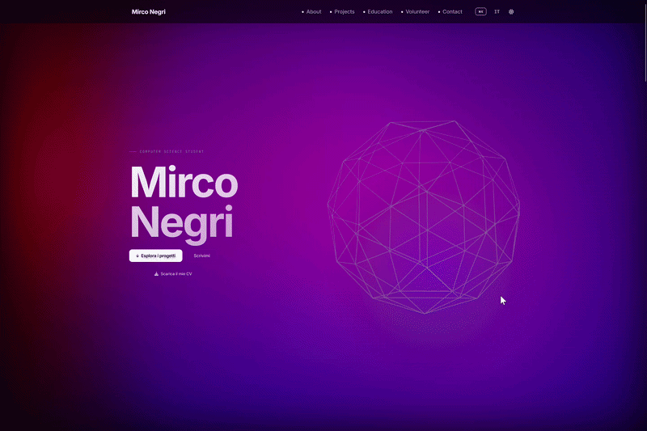
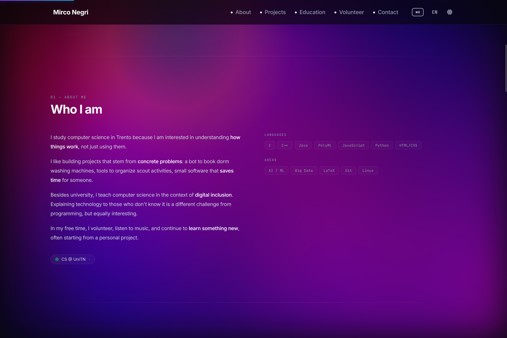

# 🌐 mirconegri.com

[](https://developer.mozilla.org/en-US/docs/Web/HTML)
[](https://threejs.org/)
[](https://pages.cloudflare.com/)
[](LICENSE)

A modern, bilingual, interactive personal portfolio — built entirely with HTML, CSS, and vanilla JavaScript, with no framework, no build step, and no bundler.

The deliberate constraint of zero dependencies forced every interactive feature — the 3D hero, the aurora background, the command palette, the world map, the film grain overlay — to be implemented from first principles. The result is a site that loads in under a second, scores well on Lighthouse, and has no supply-chain risk from third-party packages.

## Table of Contents

- [Preview](#preview)
- [Features](#features)
- [Tech Stack](#tech-stack)
- [Design Tokens](#design-tokens)
- [Design Decisions](#design-decisions)
- [Project Structure](#project-structure)
- [Getting Started](#getting-started)
- [Usage](#usage)
- [Configuration and Environment](#configuration-and-environment)
- [Contributing](#contributing)
- [License](#license)

## Preview

| Section | Dark | Light |
|:--|:--:|:--:|
| **Hero** |  |  |
| **Projects** |  |  |
| **Education** |  |  |
| **Volunteering** |  |  |
| **Places** |  |  |
| **Contact** |  |  |
| **Changelog** |  |  |
| **About** |  |  |
| **Privacy** |  |  |

## Features

- Light and dark mode with fluid transition, persisted via `localStorage`
- Bilingual (Italian / English) toggle without page reload — driven by `data-it` / `data-en` attributes on every text node, with no separate page or route per language
- Aurora canvas background — real-time 2D canvas animation with drifting color blobs that adapt to the active theme via composite blend modes
- 3D wireframe icosahedron in the hero section built with Three.js, tracking mouse movement
- Morphing cursor orb — a custom element that follows the pointer and continuously morphs its border-radius and hue
- 3D tilt cards — vanilla JS perspective transforms on project and volunteer cards based on mouse coordinates
- Scroll-reveal animations via Intersection Observers, animated top progress bar, and a navbar that hides on downward scroll
- Film grain overlay — SVG noise texture animated purely in CSS, zero canvas cost
- Intro screen — animated first-visit overlay with a typing effect, shown once per session via `sessionStorage`, skippable
- Command palette (⌘K) — fuzzy-searchable navigation and quick actions: jump to section, toggle theme or language, copy email, open project links
- Interactive world map — custom Canvas 2D implementation with Natural Earth-derived borders, hoverable countries, and pinned locations (home, university, trips, scout routes)
- Fully responsive — custom mobile menu, fluid CSS grid, and `clamp()`-based typography
- Contact form via Formspree with a required privacy-policy consent checkbox
- Privacy policy pages for both the site (`privacy.html`) and the companion LifeOS app (`lifeos-privacy.html`), both bilingual

> **Work in progress:** `js/scrollytelling.js` implements a Three.js + GSAP ScrollTrigger fly-through sequence with a `DEBUG_MODE` waypoint editor. This script is not currently loaded by `index.html` and depends on `house.glb` plus GSAP/ScrollTrigger/GLTFLoader CDN scripts that are not yet wired in. It is an unfinished feature, not active functionality.

## Tech Stack

- **Markup:** HTML5 with `data-it` / `data-en` localization attributes
- **Styling:** CSS3 — custom properties, grid, flexbox, `clamp()`, responsive breakpoints
- **Scripting:** Vanilla JavaScript — Intersection Observers, Canvas 2D, Web Animations API, `sessionStorage`, `localStorage`
- **3D:** Three.js r128 via CDN
- **Icons:** Font Awesome 6.5.0 via CDN
- **Typography:** Self-hosted Inter and JetBrains Mono via `@font-face` — migrated from Google Fonts to avoid transmitting visitor IP addresses to Google's servers, as noted in the site's own Privacy Policy
- **Forms:** Formspree (contact form backend — no custom server required)
- **Hosting:** Cloudflare Pages — every push to `main` triggers a deploy in approximately 30 seconds

> `index.html` loads the Leaflet CSS stylesheet from CDN, but no Leaflet JS is present and no `L.map()` calls exist anywhere in the codebase. The world map is a fully custom Canvas 2D implementation. This CSS import is an unused leftover and can be removed.

## Design Tokens

Defined in `css/tokens.css` and consumed as CSS custom properties throughout:

| Token | Dark | Light |
|---|---|---|
| Base background | `#07070A` | `#F8F8FB` |
| Surface | `#0D0D12` | `#F1F2F7` |
| Primary text | `#F5F7FA` | `#0F172A` |
| Accent — purple | `#7c3aed` | `#7c3aed` |
| Accent — indigo | `#4f46e5` | `#4f46e5` |
| Accent — cyan | `#06b6d4` | `#06b6d4` |

## Design Decisions

**Why no framework or bundler?** A portfolio site is a document with progressive enhancement, not an application. Adding React or Vue would mean shipping a runtime, a virtual DOM, and a hydration cost for what is ultimately a set of static sections. Vanilla JS with Intersection Observers and CSS custom properties achieves everything the design requires with a fraction of the payload and zero build-time complexity.

**Why self-host fonts?** Google Fonts embeds a tracking pixel that transmits the visitor's IP address to Google's servers on every page load. For a site that includes its own Privacy Policy and explicitly describes its data handling, using Google Fonts would be a direct contradiction. Self-hosting via `@font-face` adds two HTTP requests (woff2 files, cached after first load) with no privacy tradeoff.

**Why Cloudflare Pages over GitHub Pages?** Cloudflare Pages provides an automatic global CDN, edge caching, and HTTPS with no configuration — the same outcome as GitHub Pages but with better latency internationally, which matters for a portfolio viewed by recruiters across different regions.

**Why a custom Canvas 2D world map instead of Leaflet?** Leaflet is a feature-rich mapping library designed for interactive GIS applications with tile layers, zoom controls, and marker clusters. The use case here is a decorative, non-navigable map showing a handful of personal pins. Loading Leaflet (plus a tile provider) for this would be roughly 200 KB of JavaScript and thousands of tile requests for a purely aesthetic element. The custom Canvas implementation does the same visual job in under 150 lines of code and zero network requests beyond the GeoJSON border data.

## Project Structure

```
mirconegri.com/
├── index.html
├── privacy.html                  # Privacy policy for this site
├── lifeos-privacy.html           # Privacy policy for the LifeOS companion app
├── LICENSE
├── css/
│   ├── tokens.css                # Design tokens, theme variables, reset
│   ├── light-mode.css            # Light theme overrides
│   ├── layout.css                # Scroll progress bar, aurora canvas, sections, footer
│   ├── navbar.css                # Fixed navbar and mobile menu
│   ├── hero.css                  # Hero section and CTA buttons
│   ├── sections.css              # All content sections
│   ├── fonts.css                 # Self-hosted @font-face declarations
│   └── extras.css                # Film grain, intro screen, command palette
├── js/
│   ├── aurora.js                 # Animated gradient blob background
│   ├── threejs-hero.js           # 3D wireframe icosahedron
│   ├── orb.js                    # Cursor-following morphing orb
│   ├── ui.js                     # Navbar, theme/language toggle, scroll reveal, card tilt
│   ├── intro.js                  # First-visit intro overlay
│   ├── grain.js                  # Film grain overlay injection
│   ├── map.js                    # Custom Canvas 2D world map
│   ├── palette.js                # Command palette
│   └── scrollytelling.js         # Not loaded — see Features note above
├── fonts/
│   ├── inter/                    # woff2 files referenced by fonts.css
│   └── jetbrains-mono/           # woff2 files referenced by fonts.css
└── assets/
    ├── CV_Mirco_Negri.pdf        # Linked by the hero "Download CV" button
    ├── lifeos-icon.png           # Referenced by lifeos-privacy.html
    └── ...                       # Preview screenshots and GIFs used in this README
```

## Getting Started

### Prerequisites

- Any modern browser
- A local HTTP server is optional but recommended to avoid any `file://` protocol restrictions

### Installation

```bash
git clone https://github.com/mirconegri/mirconegri.com.git
cd mirconegri.com
open index.html
```

Or serve locally:

```bash
python3 -m http.server 8000
# then open http://localhost:8000
```

No build step, no `npm install`, no compilation.

## Usage

- **Live:** [mirconegri.com](https://mirconegri.com)
- **Local:** open `index.html` directly or via a local server as shown above

Deployed via Cloudflare Pages connected to this repository. Every push to `main` triggers an automatic deploy.

## Configuration and Environment

No `.env` file and no build-time environment variables. The only runtime integration points are:

| Item | Location | Notes |
|---|---|---|
| Formspree endpoint | `index.html` — `<form action="https://formspree.io/f/xpqedpyo">` | Tied to the author's Formspree account — replace the endpoint ID to reuse the form |
| CV file | `assets/CV_Mirco_Negri.pdf` | Linked by the hero "Download CV" button — replace with your own file at this path |
| LifeOS icon | `assets/lifeos-icon.png` | Referenced by `lifeos-privacy.html` |

## Contributing

This is a personal portfolio, but bug reports and suggestions are welcome:

1. Fork the repository
2. Create a feature branch (`git checkout -b feature/your-feature`)
3. Commit your changes with a clear message
4. Open a Pull Request

For broken links or layout issues, open an [Issue](https://github.com/mirconegri/mirconegri.com/issues).

### Author

**Mirco Negri** — Computer Science @ UniTrento

[](https://mirconegri.com)
[](https://github.com/mirconegri)
[](https://www.linkedin.com/in/mirco-negri-263810225)
[](mailto:mirconegri06@gmail.com)

## License

This project is licensed under the MIT License — see the [LICENSE](LICENSE) file for details.
